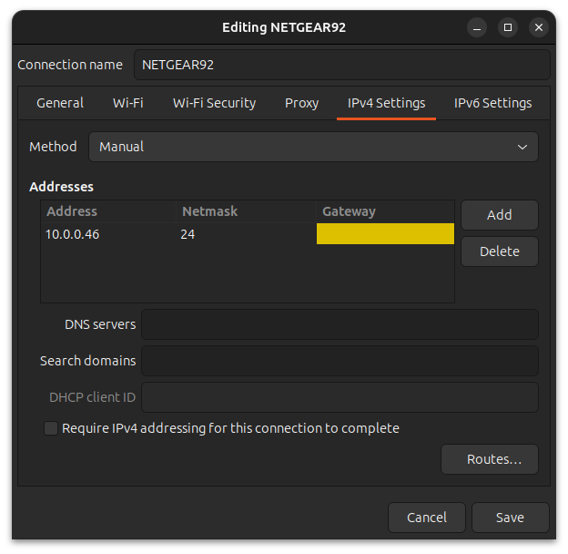

# ROS2 Vicon Bridge


Provides a simple ros2 vicon bridge, heavily inspired by https://github.com/ethz-asl/vicon_bridge

The Vicon SDK 1.12 source files are provided here so they can be compiled from source.

Only Linux is supported. 


We provide two types of nodes. One uses the standard `ViconSDK::Client` (i.e., the ROS node publishes each frame that is received from the ViconSDK)  or the `ViconSDK::RetimingClient` (i.e., it interpolates the vicon messages and publishes them at a fixed rate). 

In our experience, the `Client` version is likely the better choice for most robotics applications, since it doesnt extrapolate data. 
## Installation

Install `ros2` and ensure the following `Boost` libraries are available. 
```
sudo apt-get install libboost-thread-dev libboost-date-time-dev
```
The source code of the `ViconSDK` has been copied from Vicon and provided in this repo, meaning it should be able to build for both `x86` and `aarch64` systems, and possibly others. 

You also need to grab the `diagnostic-updater` package:
```
sudo apt-get install ros-${ROS_DISTRO}-diagnostic-updater
```

From your `colcon_ws` run 
```
colcon build --symlink-install
```

## How to connect to the vicon system in the Mobile Arena
Run the following and select the netgear vicon router:
```
nm-connection-editor
```

Head to the ipv4 settings and make these changes:


Save and try pinging the system:
```
ping 10.0.0.1
```

If this is successful head to the next section.

## Usage of the standard client (recommended)
Edit `./launch/all_segments.launch.py` and set the IP address of the Vicon computer correctly. 
Then launch it through
```
ros2 launch vicon_bridge all_segments.launch.py
```

Alternatively, you can also run just the node:
```
ros2 run vicon_bridge vicon_bridge --ros-args ...
``` 
and in the `/tf` topic you will see the transform being published. Each `tf` that is published is in the form of `<tf_namespace>/<subject_name>/<segment_name>` where subject and segment names are usually the same. By default `tf_namespace=vicon`. 

It will also publish a topic `/<tf_namespace>/<subject_name>/<segment_name>` for each segment in the vicon datastream. This topic is a `geometry_msgs::msg::TransformStamped` message, and the `header.stamp` is the timestamp **corrected** for latency, as reported by VICON. 

You need to set a bunch of parameters:

### Parameters 
- [string] `host_name`: in the format of `<ip_address_of_computer_running_vicon_tracker>:801`
- [string] `stream_mode`: either `ClientPull` or `ServerPush` (ServerPush requires more networking bandwidth, but has lower latency)
- [double] `update_rate_hz`: the rate at which you want to poll for new messages (ideally more than 2x the frequency of the incoming vicon messages)
- [bool] `publish_specific_segment`: if `true` it will only publish the tf for a specific agent. Helps reduce the number of messages published. if `false`, it will publish a `tf` message for each segment. 
- [string] `target_subject_name`:  if `publish_specific_segment` is true, this is the subject that will be published
- [string] `target_segment_name`:  if `publish_specific_segment` is true, this is the subject that will be published
- [string] `world_frame_id`: this is the `frame_id`  associated with the origin of your Vicon setup. 
- [string] `tf_namespace`: sets the namespace for all published names to tf. 


Example:
```
ros2 run vicon_bridge vicon_bridge --ros-args -p host_name:="192.168.2.136:801"
```

It also prints to the console the number of times it missed an update, and failed to publish a message.  Every second, it also publishes the latency of the last message. 


## Usage of the retiming client
```
ros2 run vicon_bridge vicon_bridge_retiming --ros-args ...
``` 
and in the `/tf` topic you will see the transform being published. Each `tf` that is published is in the form of `<tf_namespace>/<subject_name>/<segment_name>` where subject and segment names are usually the same. By default `tf_namespace=vicon`. 

You need to set a bunch of parameters:

### Parameters 
- [string] `host_name`: in the format of `<ip_address_of_computer_running_vicon_tracker>:801`
- [double] `max_prediction_ms`: in the `RetimingClient` it is allowed to predict the state of the target, by upto `max_prediction_ms` milliseconds
- [double] `update_rate_hz`: the rate at which you want to publish the state estimate
- [bool] `publish_specific_segment`: if `true` it will only publish the tf for a specific agent. Helps reduce the number of messages published. if `false`, it will publish a `tf` message for each segment. 
- [string] `target_subject_name`:  if `publish_specific_segment` is true, this is the subject that will be published
- [string] `target_segment_name`:  if `publish_specific_segment` is true, this is the subject that will be published
- [string] `world_frame_id`: this is the `frame_id`  associated with the origin of your Vicon setup. 
- [string] `tf_namespace`: sets the namespace for all published names to tf. 


Example:
```
ros2 run vicon_bridge vicon_bridge_retiming --ros-args -p host_name:="192.168.2.136:801" -p max_prediction_ms:=25 -p --update_rate_hz:=100.0
```

It also prints to the console the number of times it missed an update, and failed to publish a message. 


